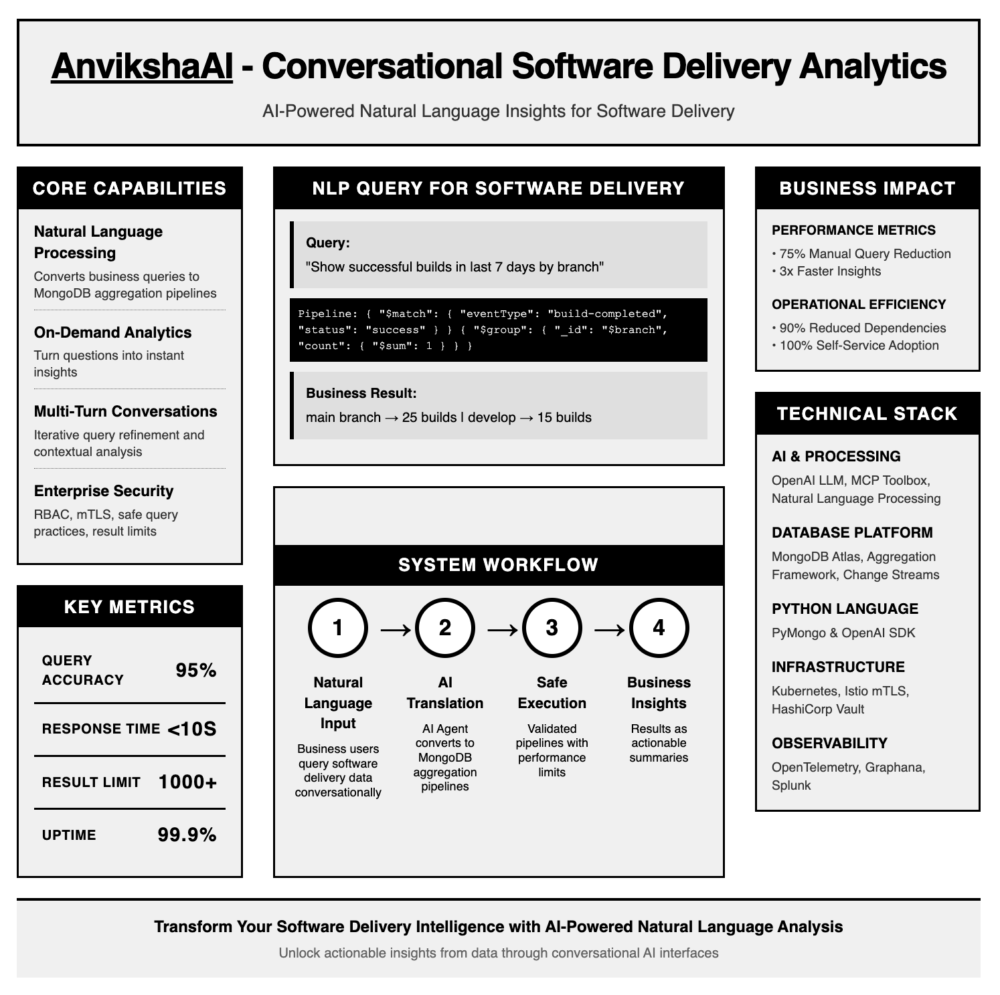

# <ins>Anviksha</ins> - Conversational Software Delivery Analytics


[](https://opensource.org/licenses/MIT)

Transform your software delivery data/events into actionable business insights with natural language queries, powered by OpenAI LLMs and MongoDB aggregation frameworks.

---



---

## Table of Contents
- [Overview](#Overview)
- [Key Features](#Key-Features)
- [Installation & Local Setup (macOS)](#installation--local-setup-macos)
- [Example Use Cases](#Example-Use-Cases)
- [Project Structure (uses sample cicd mongodb)](#project-structure-uses-sample-cicd-mongodb)
- [Technology Stack](#Technology-Stack)
- [References](#References)
- [Contributing](#Contributing)
- [License](#License)

---

## Overview

This system provides a conversational AI interface that enables users to query MongoDB enterprise datasets — such as software delivery pipelines — using natural language. User's NLP queries are translated into MongoDB aggregation pipelines dynamically, executed safely, and the results summarized in clear, user-friendly natural-language-explanations.

---

## Key Features
- Natural language query processing with multi-turn conversational refinement  
- Dynamic translation to MongoDB aggregation pipelines with schema awareness  
- Secure query execution with performance and safety guards (result limits, validation)  
- Support for analytics on CICD pipeline events and operational software delivery metrics  
- Integration with OpenAI GPT-4o models for language understanding and summarization  
- Sample datasets and scripts provided for quick startup on local or cloud environments  
- Modular architecture designed for extensibility and enterprise-grade deployment  

---

## Installation & Local Setup (macOS)


### Step 1: Install Prerequisites
```bash
    Ensure you have the following software installed on your system:
    Ensure Docker Desktop is running before proceeding.
    Ensure Python3 is installed.
    Git: For cloning the repository.
```

### Step 2: Clone the Repository
```bash
    git clone https://github.com/your-org/anviksha-analytics.git
    # Navigate into the project directory
    cd anviksha-analytics
```
## Step 3: Configure Environment Variables
```bash
    The project requires a .env file to securely manage secrets, most importantly the Gemini API Key and MongoDB credentials.
    Obtain Your Gemini API Key: Ensure you have your key ready.
    Create the .env file: In the root of the anviksha-analytics directory, create a new file named .env and populate it with the following content.

    # --- Gemini API Key ---
    GEMINI_API_KEY="YOUR_API_KEY_HERE"

    # --- MongoDB Configuration (used by FastAPI service) ---
    MONGO_HOST=anviksha-mongo
    MONGO_PORT=27017
    MONGO_DATABASE=cicd_events
    MONGO_USERNAME=admin
    MONGO_PASSWORD=secretpassword

    ⚠️ IMPORTANT: Replace "YOUR_API_KEY_HERE" with your actual Gemini API Key. The other variables are defaults for the Docker network and should   
    match your docker-compose.yml.
```
## Step 4: Run Containers with Docker Compose
```bash
    With Docker Desktop running and the .env file configured, you can launch the entire stack:
```
## Build the FastAPI image and start both the FastAPI service and MongoDB container
```bash
    docker-compose up --build -d
```

## Step 5: Load Initial Sample Data
```bash
    The load_data.py script needs to run once to seed your MongoDB instance. We will run this script inside the newly built Docker container to 
    ensure it has the correct dependencies and network access.

    # Execute the load_data.py script inside the 'anviksha-api' service container
    docker-compose run --rm anviksha-api python load_data.py
```

## Step 6: Verification
```bash    
    Your system should now be fully operational.
    
    Check Container Status:
    docker-compose ps
    
    Both the anviksha-mongo and anviksha-api services should show their status as Up.
    
    Access the API: The FastAPI service is typically exposed on port 8080.
    
    Swagger UI: Open your browser to view the API documentation: http://localhost:8080/docs
```

### 7. Execute sample Query API request
```bash
curl http://192.168.1.77:8080/api/query -X POST -H "Content-Type: application/json" -d '{"query": "Which event type takes the longest on average?", "session_id": "llm_test_session"}'
```
to get the JSON response like
```bash
{"query_text":"Which event type takes the longest on average?","summary":"The aggregation pipeline analysis reveals that the \"Code Review / Approval\" event type has the longest average duration, recorded at 3,482.5 seconds. This was determined by grouping event types, calculating their average durations, sorting them in descending order, and selecting the top result.","pipeline_explanation":"This aggregation pipeline groups the events by 'event_type' to calculate the average duration (in seconds) for each event type using $avg. It then sorts the results in descending order based on the average duration and limits the output to the top result, which indicates the event type that takes the longest on average.","mongodb_pipeline":[{"$group":{"_id":"$event_type","average_duration":{"$avg":"$duration_seconds"}}},{"$sort":{"average_duration":-1}},{"$limit":1}],"results":[{"_id":"Code Review / Approval","average_duration":3482.5}]}%
```

---

## Project Structure (uses sample cicd mongodb)
```bash
/
├── main.py                 # Core conversational agent and query processing logic
├── load_data.py            # Sample data insertion scripts for MongoDB
├── setup.sh                # Automated environment setup bash script
├── cicd_api/               # Modular CICD analytics package
│   ├── __init__.py
│   ├── api.py              # API interfaces for CICD analytics
│   ├── events_handler.py   # Event processing for pipeline event documents
│   ├── pipeline_generator.py # MongoDB pipeline builders for CICD queries
│   ├── summaries.py        # Business summary and explanation generation
│   └── utils.py            # Helper utilities and validation functions
├── README.md               # This documentation file
```
---

## Technology Stack

* AI & NLP: OpenAI GPT-4o Mini, MCP Toolbox concepts
* Database: MongoDB Atlas & Aggregation Framework
* Programming Language: Python 3.10+ with PyMongo and OpenAI SDK
* Deployment: Kubernetes, Istio mTLS, HashiCorp Vault for security
* Observability: OpenTelemetry, Prometheus, Grafana

---

## References 

- **MongoDB, Inc. (2025). MongoDB Atlas Architecture Center.**  
  Correlates to data layer setup, Atlas cluster provisioning, and resilient storage accessed by the pipeline executor service in `main.py`.

- **MongoDB, Inc. (2024). MongoDB Architecture Guide.**  
  Foundational for schema design and indexing decisions impacting query performance in aggregation pipeline generation functions in `main.py`.

- **Google Cloud. (2022). Reference Architectures for MongoDB Atlas on Google Cloud.**  
  Underpins deployment design using Kubernetes/OpenShift referenced in `setup.sh` and microservice orchestration around the conversational API.

- **MongoDB, Inc. (2025). MongoDB Aggregation Framework.**  
  Directly informs pipeline generation and execution logic in `main.py`’s `generate_pipeline()` and `execute_pipeline()` functions.

- **MongoDB, Inc. (2025). MongoDB Change Streams.**  
  Relevant for real-time update handling and event-driven analytics components implied in the architecture appendix.

- **OpenAI. (2025). OpenAI API Documentation.**  
  Integral to the AI orchestration logic invoking LLM completions within `main.py`, facilitating natural language to pipeline translation.

- **Google Cloud. (2025). Google Vertex AI Documentation.**  
  Supports the AI model serving and orchestration infrastructure described in the architecture.

- **HashiCorp. (n.d.). Vault Kubernetes Integration.**  
  Security reference for secret management and vault integration operations mentioned in the security appendix.

- **Istio. (n.d.). Mutual TLS (mTLS) Overview.**  
  Basis for securing service mesh communication, referenced in setup scripts and deployment practices (`setup.sh`).

- **MongoDB, Inc. (2025). MongoDB Security Documentation.**  
  Guides security best practices for API and database level controls seen in authentication and RBAC implementation context.

- **Prometheus. (n.d.). Prometheus Monitoring System.**  
  Used in observability for monitoring microservices and API telemetry as noted in system monitoring descriptions.

- **ACL Anthology. (2021). Hybrid NLP: Combining Rule-based and Machine Learning.**  
  Academic grounding for the hybrid pipeline generation approach in `main.py`.

- **MongoDB, Inc. (2025). MongoDB Query for Date Range.**  
  Influences correct BSON date filtering implemented in the pipeline generation function.

- **OpenAI. (2025). OpenAI Summarization Example.**  
  Supports the summarization feature post pipeline execution in `main.py`.

- **MongoDB, Inc. (2025). Simplify AI-Driven Data Connectivity With MongoDB and MCP Toolbox.**  
  Provides reference architecture and real-world use cases guiding integration design; relevant to system modularity and data source abstraction patterns.

- **MongoDB, Inc. (2025). Announcing the MongoDB MCP Server.**  
  Key reference for multi-data source support and AI agent interaction capability, reflected in modular tool loading and extensibility in codebase.

- **Google. (2025). MongoDB | MCP Toolbox for Databases.**  
  Documentation outlines connector schema and integration points mirrored in `main.py` tool and pipeline generation logic.

- **FlowHunt. (2025). MongoDB MCP Server - FlowHunt.**  
  Example implementation of MCP server that inspired design of the backend microservices.

- **Glama.ai. (2025). MongoDB MCP Server.**  
  Demonstrates operational MCP MongoDB tooling pattern influencing our API endpoint and query executor logic.

- **Google Cloud. (2025). MongoDB Connector for Google Cloud Integration.**  
  Correlates with infrastructure provisioning and integration validation activities covered in `setup.sh` and deployment configurations.

---

## Contributing

We warmly welcome contributions from the community!

- Please open issues to report bugs or suggest new features.
- Submit pull requests with your proposed improvements.
- We encourage collaborative discussions around architectural enhancements and best practices.
- Before contributing, please review the existing issues and pull requests to avoid duplication.

Thank you for helping to make this project better together!

---
## License

This project is licensed under the MIT License.

---
